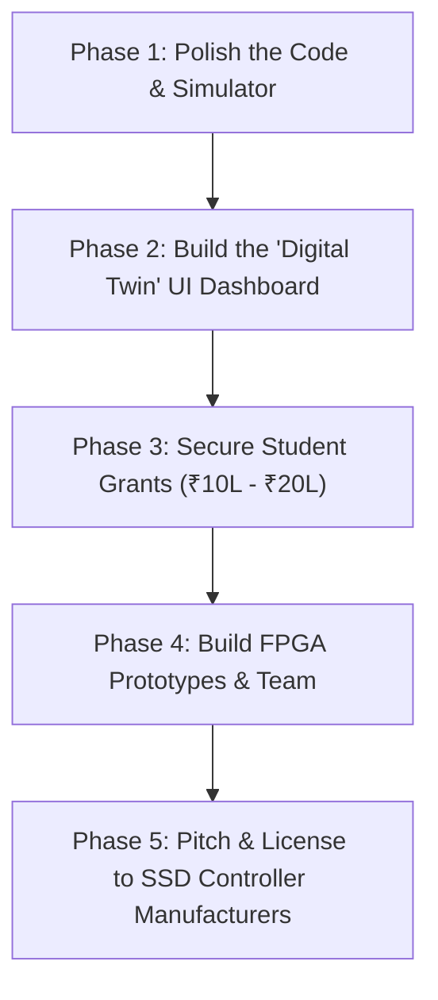

# Aegis-One: Zero-Capital Startup & IP Licensing Roadmap
## A Step-by-Step Guide for the Founder

This roadmap outlines how to take the **Aegis-One** storage controller architecture from its current codebase state to a commercial IP licensing deal (making up to ₹42 Lakhs/month in royalties) starting with **₹0 upfront capital**.

---

## 🗺️ The 5-Phase Execution Plan



---

## 🛠️ Phase 1: Polish the Code & Simulator (Today)
Your current codebase has a Rust storage engine simulator and Verilog RTL designs. Before pitching to anyone, we need to make the simulation highly realistic.

### Action Items:
1. **Fix HMB Emulation Limits:** 
   * Currently, the Rust FTL simulator (`lib.rs`) uses standard memory maps to simulate cached blocks. Refactor it to mimic PCIe DMA block transfers specifically to simulate latency overhead.
2. **Improve Metadata Pathing:** 
   * Move beyond bypassing HMB only for `LBA < 100`. Design a parser that detects active directory blocks or Force Unit Access (FUA) commands so metadata is never cached in volatile HMB, preventing filesystem corruption.
3. **Run Local Verification:**
   * Regularly run the verification suite to ensure all tests pass:
     ```powershell
     ./verify.ps1
     ```

---

## 💻 Phase 2: Build the "Digital Twin" UI (Weeks 1–4)
Manufacturers and investors will not read raw code. They want to see the performance and wear savings visually.

### Action Items:
1. **Connect Daemon to a Visual UI:**
   * Your telemetry daemon (`infinity_cache_daemon`) is set up with a WebSocket broadcaster on `127.0.0.1:3030`.
   * Create an interactive web dashboard (`infinity_cache_ui`) that listens to the telemetry.
2. **Visualize Key Metrics:**
   * Show live graphs of:
     * **Cache Hit Rate:** How much write volume is absorbed by host RAM vs. physical UFS.
     * **Flash Wear Savings:** A calculation of how many years of extra life the drive gets because of HMB caching.
     * **Thermal Performance:** Real-time temperature comparison (51°C Aegis-One vs. 98°C traditional NVMe).
3. **Interactive Demos:**
   * Build buttons to trigger "Sudden Power Loss" or "OS Crash" to visually demonstrate how the host-managed PLP successfully flushes RAM pages in milliseconds.

---

## 💰 Phase 3: Secure Student Grants (Months 1–3)
Since you are a student, you have access to equity-free government grants that older founders cannot easily get.

### Key Targets:
1. **NIDHI-PRAYAS (India):**
   * **What it is:** Government grant for hardware prototypes.
   * **Funding amount:** Up to **₹10 Lakhs** (100% equity-free, no payback required).
   * **How to apply:** Partner with a DST-approved incubator (e.g., local IIT/NIT incubation cells). You only need a working software twin/simulator to qualify.
2. **College Incubation Cells:**
   * If you are entering university, apply directly to the college entrepreneurship cell. They will provide free lab space, access to expensive electronics tools (oscilloscopes, logic analyzers), and hosting credits.
3. **Startup India Seed Fund (SISFS):**
   * Up to **₹20 Lakhs** for validation and prototype refinement.

---

## 🤝 Phase 4: Recruit Co-Founders & Build FPGA Prototypes (Months 3–6)
Once you have grant funding, you need to expand your technical capabilities and turn the code into physical chip designs.

### Action Items:
1. **Find a Hardware Co-Founder:**
   * Look for a senior student or partner majoring in **Electrical Engineering (EE)** or **VLSI Design**. 
   * You write the software/firmware; they handle the Verilog testing, PCB designs, and physical board routing.
2. **Build the FPGA Prototype:**
   * Buy a professional FPGA development kit (e.g., Lattice ECP5 or Xilinx Artix-7).
   * Flash your Verilog modules (`aegis_alpha_rtl_v1.v`, `panic_flush_fsm.v`) onto the FPGA.
   * Connect it to a host system via a physical PCIe adapter card to prove that host memory (HMB) DMA reads and writes work in real-time on physical silicon wires.

---

## 🚀 Phase 5: Pitch & License (Months 6+)
With a working FPGA prototype and software twin, you are ready to sell your IP to existing controller companies.

### Your Target Licensees:
*   **Tier 2/3 Controller Makers:** Phison, Silicon Motion, Maxio, Realtek.
*   **NAND Flash Manufacturers:** Micron, Kioxia, Western Digital, SK Hynix.

### The Pitch Deck Structure:
1. **The Cost Crisis:** Traditional Gen4/Gen5 SSDs are too expensive to make because of rising DRAM prices and supercapacitor failures at high temperatures.
2. **The Aegis-One Solution:** We eliminate the onboard DRAM and supercapacitors completely. We borrow Host RAM via PCIe HMB for elite speeds, and utilize host battery reserves for safe flushes.
3. **The Economics:** Our design reduces manufacturing costs (COGS) by **30%**, saving them up to **$10 (₹830) per drive**.
4. **The Proof:** Live demo of the FPGA prototype running alongside the software Digital Twin.
5. **The Deal:** **$100,000 upfront fee** (to transfer the source code and cover integration support) + **$0.50 royalty per chip** sold.

---

## 📈 Projected Financial Growth (Targeting 100k units/month)

| Revenue Stream | Value (USD) | Value (INR) | Type |
| :--- | :--- | :--- | :--- |
| **Upfront License Fee** | $100,000 | **₹84,00,000** | One-time per manufacturer |
| **Royalty per Chip** | $0.50 | **₹42** | Continuous |
| **Total Monthly Revenue** | $50,000 | **₹42,00,000** | Recurring (at 100k sales) |
